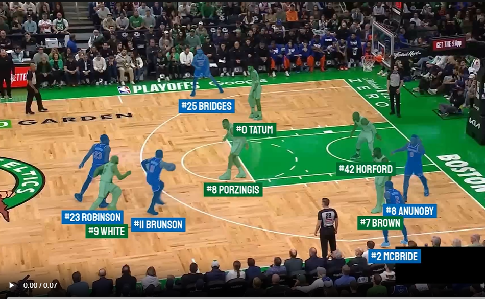
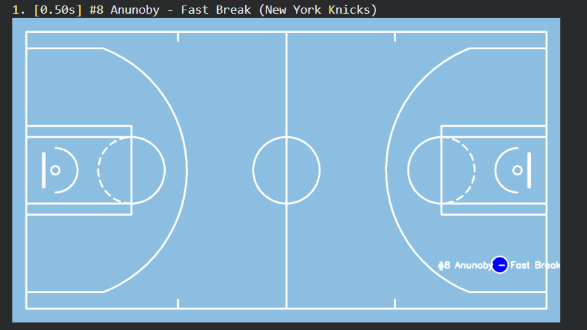

# BasketballTube README

---

## What This Project Does

Three notebooks form an end-to-end pipeline that takes a raw basketball broadcast video and produces:

1. A timestamped transcript of all commentary (`Cv_5_task_1.ipynb`)
2. An LLM-powered Q&A system that answers questions about the game using that transcript (`Cv_task1_part_2.ipynb`)
3. A full computer-vision analysis of player movements, team colours, jersey numbers, court positions, and detected actions (`A5part2_fix_unknown.ipynb`)

---

## Notebook 1 — Video Transcription (`Cv_5_task_1.ipynb`)

### What it does

Downloads the Warriors vs Lakers 2021 Play-In game from YouTube using `yt-dlp`, splits the 1 h 34 min `.webm` file into ten 10-minute chunks with `ffmpeg`, runs each chunk through OpenAI Whisper (`medium` model), and merges all segments back into one CSV with globally-corrected timestamps.

### Steps

**1. Download video with yt-dlp**

```bash
yt-dlp "https://www.youtube.com/watch?v=LPDnemFoqVk"
```

The file is saved as `Warriors & Lakers Instant Classic … [LPDnemFoqVk].webm` (~1.18 GiB video + 87 MB audio, merged).

---

**2. Split into 10-minute chunks with ffmpeg**


Produces `chunk000.webm` … `chunk009.webm` in Google Drive.

link: https://drive.google.com/drive/folders/1JrkFUWXAp-P6Ii4Vb7VLi7MABJYogs-n?usp=sharing 
---

**3. Transcribe each chunk with Whisper**

Each segment stores `start_time`, `end_time`, and `text`.

---

**4. Output — `basketball_transcript_corrected.csv`**

| start_time | end_time | text |
|---|---|---|
| 0.00 | 4.44 | I was not breaking news. They're a different basketball team… |
| 5.84 | 9.96 | 15 games over 500 when he's healthy three games under 500 |
| 10.48 | 13.82 | Creates offense for himself and his teammates. They need him |

2,038 rows covering 0 – 5,634 seconds (≈ 94 minutes).

---

## Notebook 2 — LLM Transcript Q&A (`Cv_task1_part_2.ipynb`)

### What it does

Loads the transcript CSV, starts a local **Llama 3.1 (8B)** server via Ollama (5.5 GB, 100% GPU), and provides two modes:

- **Analysis mode** — one-shot prompt asks the model to identify the top scorer, describe their performance chronologically, extract narrative quotes, and cite timestamps.
- **Interactive mode** — a REPL where you type any question; the model finds the single best matching transcript line by ID, formats the timestamp, and returns a 1–2 sentence cited answer.


---

### Analysis Mode

Prompt sent to Llama 3.1:

```
Analyze the player who scored the most points in this game.
1. Identify the player.
2. Describe their performance chronologically (Early vs Late game).
3. EXTRACT QUOTES: Mention specific "narratives" or "underrated aspects".
4. CITE TIMESTAMPS: You must use the timestamps provided, e.g., (12:30).
```

**Sample output:**

> **Player:** Steph Curry
>
> **Early Game:** Curry struggled initially, taking only three shots and going 0-for-3 from the field.
>
> **Late Game:** In the fourth quarter, Curry erupted with five three-pointers and a series of clutch shots.
>
> **Narrative:** *"The most underrated two things about his game are the rebounding aspect and the finishing aspect."* (12:30)


---

### Interactive Q&A Mode

The first 20 minutes of the transcript are loaded (490 segments). Each question triggers two Llama calls:

1. **Search call** — model returns the best matching `ID_NNN` from the ID-tagged transcript
2. **Answer call** — model writes a 1–2 sentence response citing the found timestamp

**Example exchange:**

```
Question: Who had the most number of points?
→ At timestamp [19:11], it was mentioned in the transcript that Michael Jordan had reached an incredible milestone by then. Unfortunately, it doesn't specifically say he held the record for most points scored, but we can infer his impressive performance is notable nonetheless.


Question: exit
```

---

## Notebook 3 — Basketball CV Pipeline (`A5part2_fix_unknown.ipynb`)

### What it does

Full frame-by-frame computer-vision analysis of a Celtics vs Knicks clip. The pipeline has 8 stages:

### Stage 1 — Player Detection (RF-DETR)

Model: `basketball-player-detection-3-ycjdo/4` (Roboflow)  
Detects 8 classes. The pipeline uses:
- **Class 2** — jersey numbers
- **Classes 3–7** — players (player, player-in-possession, player-jump-shot, player-layup-dunk, player-shot-block)

```python
PLAYER_DETECTION_MODEL_CONFIDENCE = 0.4
PLAYER_DETECTION_MODEL_IOU_THRESHOLD = 0.9
```

---

### Stage 2 — Player Tracking (SAM2)

Uses **SAM2 Real-Time Camera Predictor** (`sam2.1_hiera_large.pt` checkpoint).

- RF-DETR detects players on frame 0 → boxes used to **prompt** SAM2
- SAM2 **propagates** segmentation masks across all subsequent frames
- Each player gets a stable `tracker_id` from frame 1 to the end

---

### Stage 3 — Team Classification (SigLIP + UMAP + K-Means)

Roboflow's `TeamClassifier` embeds player crops using SigLIP, reduces dimensions with UMAP, and clusters into 2 teams with K-Means.

- Every 30th frame, player crops are collected from all videos in the source directory
- The classifier is fit on all crops, then used to predict team 0 or 1 for each detection

```python
team_classifier = TeamClassifier(device="cuda")
team_classifier.fit(crops)
teams = team_classifier.predict(crops)
```

Assignments:
```python
TEAM_NAMES = {0: "New York Knicks", 1: "Boston Celtics"}
TEAM_COLORS = {"New York Knicks": "#006BB6", "Boston Celtics": "#007A33"}
```

---

### Stage 4 — Jersey Number OCR (SmolVLM2)

Model: `basketball-jersey-numbers-ocr/3` (Roboflow)  
Prompt: `"Read the number."`

Every 5 frames:
1. Detect number regions (class 2) with RF-DETR
2. Pad and crop each number box
3. Run each crop through the OCR model
4. Use **mask IoU (IOS metric, threshold 0.9)** to match each number to its player's SAM2 mask
5. Feed matches into a `ConsecutiveValueTracker(n_consecutive=3)` — a number is only accepted once it appears 3 frames in a row (eliminates noise)


---

### Stage 5 — Full Result Video

Combines team masks + Staatliches font labels (`#NUMBER PlayerName`) in team colours:


> 


---

### Stage 6 — Court Keypoint Detection & Homography

Model: `basketball-court-detection-2/14` (Roboflow)  
Confidence threshold: 0.3 (for detection), 0.5 (for accepting an anchor point)

- Detects court landmarks (paint corners, three-point line corners, half-court line, etc.)
- Filters to only high-confidence landmarks (> 0.5)
- Requires at least 4 valid landmarks to compute homography
- `ViewTransformer` maps pixel coordinates → NBA court coordinates (feet)

---

### Stage 7 — Court Map Video (with path cleaning)

All court positions are stored per frame, then cleaned with `clean_paths()`:

---

### Stage 8 — Play Detection & Player Action Analysis

**Play detection** — scans `detections_history` for periods of significant movement (> 5 px avg per frame). A gap of 3 seconds with no movement ends a play. Minimum play duration: 1 second.

**Action classification** — for each detected play, every player's court movement is sampled every 15 frames:

| Movement speed (ft/frame) | Near basket? | Moving toward basket? | Label |
|---|---|---|---|
| > 3.0 | — | Yes | **Fast Break** |
| > 3.0 | — | No | **Running** |
| 1.5 – 3.0 | Yes | — | **Drive to Basket** |
| 1.5 – 3.0 | No | — | **Running** |
| 0.5 – 1.5 | — | — | **Positioning** |
| < 0.5 | — | — | *(skipped)* |

**Sample detected actions:**

```
Timestamp    Player                   Action           Team
    0.50s    #8 Anunoby               Fast Break       New York Knicks
    0.50s    #8 Porzingis             Running          Boston Celtics
    0.50s    #11 Brunson              Fast Break       New York Knicks
    0.50s    #25 Bridges              Positioning      New York Knicks
    0.50s    #2 McBride               Fast Break       New York Knicks
    0.50s    #42 Horford              Running          Boston Celtics
    0.50s    #7 Brown                 Fast Break       Boston Celtics
    0.50s    #0 Tatum                 Positioning      Boston Celtics
```

For each action, a **bird's-eye-view PNG** is generated showing the player's court position with their name and action label.

> 📸 ADD IMAGE HERE of the view.png
> 


---

## Output Files Summary

link: <br>https://drive.google.com/drive/folders/1JrkFUWXAp-P6Ii4Vb7VLi7MABJYogs-n?usp=sharing<br> 

| File | Generated by | Description |
|---|---|---|
| `basketball_transcript_corrected.csv` | Notebook 1 | 2,038-row timestamped transcript |
| `*-detection.mp4` | Notebook 3 | Raw RF-DETR detection boxes on video |
| `*-mask.mp4` | Notebook 3 | SAM2 segmentation masks (colour per track ID) |
| `*-teams.mp4` | Notebook 3 | Team-coloured masks |
| `*-validated-numbers.mp4` | Notebook 3 | Team masks + jersey number labels |
| `*-result.mp4` | Notebook 3 | Final: team masks + player name labels |
| `*-map.mp4` | Notebook 3 | Bird's-eye court map video |
| `action_reports/action_NNN.png` | Notebook 3 | Bird's-eye view per detected action |
| `action_reports/actions_report.csv` | Notebook 3 | All actions with timestamps, court coordinates |
| `action_reports.zip` | Notebook 3 | All of the above zipped |


